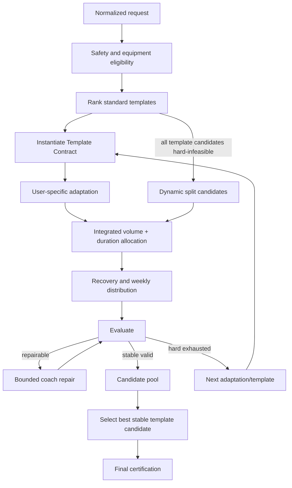

# FITSHO_COACH_LIKE_WORKOUT_ENGINE_REDESIGN

**نوع سند:** ممیزی معماری، تحلیل شکست و طراحی مجدد — بدون پیاده‌سازی  
**مخاطب:** تیم Backend، معمار سیستم، طراح Program Engine و Reviewer تمرین مقاومتی  
**Snapshot کد:** `8f7eab7ff78cef769faf0d35beaad1e7af1eebef` در 2026-08-29  
**وضعیت:** Proposal برای بررسی؛ هیچ Rule یا کد تولیدی در این تسک تغییر نکرده است.

## Executive Summary

علت اصلی Reject شدن پروفایل‌های قابل‌برنامه‌نویسی، یک Rule منفرد نیست. موتور چند بهینه‌ساز و Validator مستقل دارد که تعریف مشترکی از **Hard / Soft / Preference** ندارند و بعد از تغییر یکدیگر به نقطه پایدار بازنمی‌گردند.

زنجیره شکست غالب این است:

1. Session Builder پیش از دیدن budget واقعی هر عضله، جلسه را تا تعداد حرکت ترجیحی پر می‌کند.
2. Prescription حتی appearance با allocation صفر را به حداقل سه ست واقعی تبدیل می‌کند.
3. Volume Repair حجم بالاتر از `acceptable_maximum` را کم می‌کند، با اینکه این سقف soft است.
4. Duration Repair برای رسیدن به بازه سخت زمان، دوباره ست/حرکت اضافه می‌کند؛ اما فقط در focus فعلی و در chunkهای سه‌ستی.
5. فضای Repair به سقف ۹ حرکت، ۴ ست برای هر حرکت، ۱۲ ست مستقیم عضله در جلسه، direct-frequency cap، semantic duplicate و weekly hard effective volume برخورد می‌کند.
6. Recovery و Weekly Redistribution فقط subset محدودی از اصلاح‌ها را انجام می‌دهند.
7. Duration Certification هر اصلاح late-stage لازم را محاسبه می‌کند ولی اگر واقعاً برنامه را عوض کند، نتیجه را دور می‌اندازد.
8. Validation بعضی deviationهای soft را hard error می‌کند و Final Gate بدون یک چرخه Repair دیگر برنامه را Reject می‌کند.

شواهد اجرایی:

- گزارش tracked یازده پروفایل synthetic/realistic روی production Service flow فقط **۴ success و ۷ error** دارد: `reports/workout_engine_11_profiles.html:234-248`؛ Trace تازه هر هفت را `UNSATISFIED_CONSTRAINT` بازتولید کرد.
- ماتریس کنترل‌شده ۲۰ پروفایل ۳ تا ۶ روزه و ۴۵ تا ۱۲۰ دقیقه روی کاتالوگ deterministic فقط **۷ PASS و ۱۳ FAIL** داشت.
- در `5d/60m`، Volume Repair یک روز Back را از ۵۱ دقیقه/چند حرکت به ۲۲ دقیقه و ۳ حرکت رساند؛ Duration Repair فقط آن را به ۲۴ دقیقه رساند، چون تمام کاندیداهای focus-compatible به weekly hard effective-volume cap برخورد کردند.
- در `4d/75m`، یک روز Chest در ۵۶ دقیقه متوقف شد؛ set cap=4، session cap=12، hard volume و focus restriction همه مسیرهای افزودن را بستند.
- در `3d/90m`، روز اول در ۷۸ دقیقه و سقف ۹ حرکت متوقف شد؛ فقط دو دقیقه تا minimum لازم فاصله داشت، اما هیچ Repair operator مجاز باقی نماند.

سه برداشت مثبت و مهم نیز از کد اثبات شد:

- موتور واقعاً **Template-first** است و همه Templateهای eligible رتبه‌بندی‌شده را قبل از Dynamic Split امتحان می‌کند (`engine.py:171-268`).
- `session_duration_minutes` در کد فعلی به‌درستی زمان اصلی Resistance است؛ anatomical core و cardio از آن خارج‌اند و tolerance مرکزی `±10` است (`duration_policy.py:52-80,120,207-215`).
- Duration Repair برای پر کردن زمان، rest را مصنوعی زیاد نمی‌کند (`session_duration.py:532-534`).

نتیجه معماری: Safety، تجهیزات، exact-day و `requested duration ±10` باید سخت بمانند. راه‌حل، خاموش‌کردن Validatorها نیست؛ راه‌حل یک **Shared Constraint Evaluator + Deterministic Bounded Coach Repair Loop** است که Template topology، workload، volume، duration و recovery را هم‌زمان ارزیابی کند و فقط پس از اثبات exhaustion همه Repairهای امن، Reject دهد.

## Scope, Evidence, and Confidence

### برچسب شواهد

- **CODE:** رفتار مستقیماً از کد snapshot قابل اثبات است.
- **TRACE:** رفتار در اجرای واقعی یا تست instrumented مشاهده شده است.
- **SCIENTIFIC:** نتیجه از پژوهش peer-reviewed یا position stand آمده است.
- **PRACTICE:** عرف مربی‌گری عمومی؛ شواهد علمی مستقل محسوب نمی‌شود.
- **ENGINE INFERENCE:** استنتاج معماری از ترکیب کد و Trace؛ ادعای فیزیولوژیک نیست.

### کار انجام‌شده

- ۵۲ فایل production در `program_engine` و مسیر Service/Profile/Template loader بررسی شدند.
- call graph هر دو مسیر Template و Dynamic تا Final Gate دنبال شد.
- تست‌های Golden، Regression، Duration، Volume، Recovery و Template بررسی شدند.
- ۲۰ ترکیب duration/day روی یک ورودی ثابت و کاتالوگ deterministic اجرا و stageهای قبل/بعد Repair instrument شدند.
- تست‌های focused non-DB: **۱۵۶ passed**.
- تست‌های DB-backed Template/Benchmark: **۶۳ passed، ۱ warning**؛ subset دوم **۱۴ passed** تا توقف دستی اجرای پرهزینه. ادعای pass برای کل suite نشده است.
- artifact تاریخی ۳۷۵ پروفایل نیز فقط برای context بررسی شد؛ چون fresh روی HEAD نیست، وضعیت current تلقی نشده است.

## Current Engine Flow

### 1. Request and Service Boundary

`WorkoutPlanService.generate()` پروفایل، override و Body Analysis را می‌گیرد؛ سپس `_to_program_request()` تجهیزات، training age، cautions، priority، روز و مدت را به `ProgramGenerationRequest` تبدیل می‌کند. Cautionهای ساختاری به `blocked_caution_tags` تبدیل می‌شوند و legacy free-text limitation وارد generation نمی‌شود.

شواهد: `backend/app/workouts/service.py:230-276,934-1010` در snapshot اعلام‌شده.

پیش از ورود به engine، `require_supported_resistance_training_days()` بعضی ترکیب‌های level/day را رد می‌کند. بنابراین بعضی failureها اصلاً به Template/Repair نمی‌رسند: `backend/app/profile/training_compatibility.py:14-55,78-85` و `service.py:1006-1009`.

### 2. Normalization and Safety

`generate_program()` ابتدا day compatibility را کنترل می‌کند، Body Analysis قابل‌اعمال را normalize می‌کند، seed deterministic می‌سازد، training status را محافظه‌کارانه طبقه‌بندی و constraints را استخراج می‌کند:

- `engine.py:99-128`
- `normalization.py:15-40,61-92`
- `constraints.py:6-43`
- `safety.py:51-82`

Red flag، medical condition کنترل‌نشده، pregnancy/postpartum یا limitation غیرقابل‌محاسبه می‌تواند generation خودکار را متوقف کند. این بخش باید hard باقی بماند.

### 3. Eligibility and Capacity

`filter_eligible_exercises()` active/programming/review status، metadata، تجهیزات، سطح مهارت، caution، impact، axial load، balance، overhead و ROM را کنترل می‌کند (`eligibility.py:57-128`).

`build_session_capacity()` کل `session_duration_minutes` را resistance budget می‌گیرد؛ cardio را کم نمی‌کند. ولی capacity را با یک exercise نماینده median و یک هزینه عمومی برآورد می‌کند (`duration_capacity.py:133-192,239-304`). این برآورد، composition واقعی روز، focus، نسبت compound/isolation و catalog availability هر role را دقیق مدل نمی‌کند.

### 4. Template Selection First

Templateها بر اساس hard eligibility انتخاب می‌شوند:

- exact days
- supported level
- resolvable core slots
- required core duration که provably infeasible نباشد

شواهد: `template_selector.py:306-369`.

سپس همه Templateهای ranked به ترتیب امتحان می‌شوند و فقط بعد از exhaustion کامل آن‌ها Dynamic Split آغاز می‌شود (`engine.py:171-268`). بنابراین ادعای «موتور Template را نادیده می‌گیرد» نادرست است.

اما ranking با `score.total` قبل از feasibility مرتب می‌شود (`template_selector.py:215-225`) و `template_scoring.py:76-110` عمدتاً priority، Body Analysis، بعضی goalها، sex prior و balanced tag را score می‌کند. Hypertrophy/Muscle Gain/Fat Loss/Muscular Endurance goal affinity مشخصی در `_goal_score()` ندارند (`template_scoring.py:166-188`). کیفیت نهایی duration/volume/recovery نیز در ranking اولیه وجود ندارد.

### 5. Split Selection

اگر Templateها شکست بخورند:

1. همه splitهای ranked با exact requested day count امتحان می‌شوند.
2. سپس availability-aware dynamic fallbackها امتحان می‌شوند.
3. اگر همه رد شوند، error تجمیعی `PROGRAM_CONSTRUCTION_ALTERNATIVES_EXHAUSTED` و `REQUESTED_TRAINING_DAYS_UNSATISFIED` برگردانده می‌شود.

شواهد: `engine.py:269-387`.

این error تجمیعی الزاماً به معنی نساختن تعداد روز نیست؛ در Traceهای این ممیزی، exact-day schedule ساخته شد ولی بعداً Validation/Final Gate آن را رد کرد.

### 6. Weekly Volume Planning

`plan_weekly_volume()` برای عضلات tracked target، minimum، acceptable band، hard maximum و direct/effective requirement می‌سازد (`volume_planner.py:52-285`).

اگر duration capacity محدود باشد، `_limit_volume_to_duration_capacity()` یک weekly working-set capacity عمومی را به effective capacity تبدیل می‌کند. برای goalهای hypertrophy/muscle gain/strength فرض می‌کند هر ست compound دو secondary slot با credit ثابت ۰٫۵ دارد (`volume_planner.py:288-384`).

### 7. Session Construction

مسیر Dynamic:

- `build_sessions()` required slotها را انتخاب می‌کند.
- سپس تا `main_capacity` با compatible supplements پر می‌کند.
- برای ۴۵ دقیقه به بالا minimum hard برابر ۵ و preferred برابر ۸ است.

شواهد: `session_builder.py:88-148,276-312`.

نکته مهم: پارامتر `volume` در انتخاب عادی تمرین برای remaining weekly set budget استفاده مؤثر ندارد؛ Builder appearanceها را قبل از تخصیص واقعی ست تثبیت می‌کند.

مسیر Template:

- `build_template_sessions()` ابتدا slotهای Template را adapt می‌کند.
- optional/accessoryها را برای capacity حذف می‌کند.
- accessory fill فقط از target muscleهای همان template day انجام می‌شود.

شواهد: `template_sessions.py:330-443,932-1009`.

### 8. Prescription

`prescribe_sessions()` weekly direct target را میان appearanceها تقسیم می‌کند (`prescription.py:39-68`). `allocate_direct_sets()` می‌تواند برای appearance اضافی مقدار صفر بسازد (`prescription.py:228-245`)، اما `prescribe_sessions()` همان صفر را با `max(minimum_working_sets, allocated_sets)` به سه ست واقعی تبدیل می‌کند (`prescription.py:102-112`).

هر exercise سپس با rep/rest/RIR goal-specific و time estimate برنامه‌ریزی می‌شود (`prescription.py:248-350`).

### 9. Repairs and Finalization

ترتیب Dynamic و Template تقریباً یکسان است:

```mermaid
flowchart LR
  A[Prescribed sessions] --> B[Weekly Volume Repair]
  B --> C[Session Duration Repair]
  C --> D[Recovery weekday repair]
  D --> E[Session structure finalization]
  E --> F[Weekly exercise-count redistribution]
  F --> G[Duration certification]
  G --> H[Attach cardio outside main budget]
  H --> I[Validation]
  I --> J[Coach-quality metrics]
  J --> K[Final Gate]
```



شواهد Dynamic: `engine.py:573-610`.  
شواهد Template: `engine.py:857-905`.

پس از Validation، `coach_quality.py` فقط metrics می‌سازد. این metrics نه Repair را هدایت می‌کند، نه میان چند candidate معتبر انتخاب می‌کند و نه threshold مستقلی در Final Gate دارد (`coach_quality.py:16-84`, `engine.py:1166-1224`).

## Observed Failure Patterns

### ماتریس ۲۰ پروفایل کنترل‌شده

ورودی ثابت: Intermediate، training age ۳۰ ماه، Hypertrophy، Gym/all equipment، adherence=0.9، seed ثابت و `full_catalog()`؛ Template DB حذف شد تا failureهای مسیر Dynamic جدا شوند.

| Days | Duration | Outcome | اولین علت واقعی در split اول | Final symptom |
|---:|---:|---|---|---|
| 3 | 45 | PASS | `55/55/55` دقیقه؛ count `7/8/7` | — |
| 3 | 60 | PASS | `64/62/67`؛ count `9/9/9` | — |
| 3 | 75 | PASS | `66/66/67`؛ count `9/9/9` | — |
| 3 | 90 | FAIL | روز ۱ روی ۷۸ دقیقه و سقف ۹ حرکت؛ setها در cap=4 یا hard volume | duration under-target |
| 3 | 120 | FAIL | همان shape روی ۷۸ دقیقه؛ minimum لازم ۱۱۰ | duration under-target |
| 4 | 45 | PASS | `44/44/54/41`؛ count `6/6/7/5` | — |
| 4 | 60 | PASS | fallback پویا؛ `51/60/57/51` | — |
| 4 | 75 | FAIL | Chest day روی ۵۶ دقیقه؛ ۲ candidate در session cap=12 و یکی در hard volume؛ ۲۲ candidate focus-incompatible | duration under-target |
| 4 | 90 | FAIL | همان blocker؛ فاصله تا minimum بیشتر | duration + frequency/recovery از attempts دیگر |
| 4 | 120 | FAIL | همان blocker؛ minimum=110 | همان |
| 5 | 45 | PASS | `43/40/43/40/35`؛ count `6/5/6/5/5` | — |
| 5 | 60 | FAIL | Volume Repair روز Back را ۵۱→۲۲ دقیقه/۳ حرکت کرد؛ چهار candidate بعدی hard effective-volume=12 | count + duration |
| 5 | 75 | FAIL | Chest day روی ۵۶؛ capهای set/session/week و focus | count + duration |
| 5 | 90 | FAIL | همان | count + duration |
| 5 | 120 | FAIL | همان | count + duration |
| 6 | 45 | FAIL | Lower day روی ۳۵ دقیقه اما ۴ حرکت؛ چهار candidate مفید در hard volume=12؛ روز دیگر ۲۶ دقیقه/۳ حرکت | count + duration |
| 6 | 60 | FAIL | Upper day روی ۴۹؛ هر ۱۶ candidate focus-compatible با hard effective volume رد شد | count + duration |
| 6 | 75 | FAIL | همان ۴۹ دقیقه و ۱۶ rejection | count + duration |
| 6 | 90 | FAIL | Upper day روی ۵۳ و همان saturation | count + duration |
| 6 | 120 | FAIL | Upper day روی ۵۳ و همان saturation | count + duration |

**نتیجه:** ۷ PASS / ۱۳ FAIL. افزایش days و duration، demand زمانی را زیاد می‌کند ولی useful workload space زیر capهای هفتگی، fixed set chunk و focus restriction به همان نسبت رشد نمی‌کند.

### قبل و بعد Volume Repair

| Profile | Before volume repair | After volume repair | After duration repair | نتیجه |
|---|---|---|---|---|
| 4d/75m | `45/54/58/44` | `51/42/78/27` | `56/47/78/34`؛ redistribution=`47/47/78/45` | FAIL |
| 5d/60m | `45/51/44/58/49` | `51/22/27/69/22` | `52/24/35/69/24` | FAIL |
| 6d/45m | `41/44/42/44/42/44` | `50/30/42/30/35/23` | `52/35/42/35/35/26` | FAIL |

این جدول مستقیماً اثبات می‌کند که Volume Repair کار مفید را حذف می‌کند و Duration Repair بعداً همان ظرفیت را نیاز دارد، ولی به‌دلیل محدودیت کاندیدا/حجم نمی‌تواند آن را بازسازی کند.

### یازده پروفایل Synthetic روی Production Service Flow

Artifact موجود `reports/workout_engine_11_profiles.html` در همان snapshot شامل ۱۱ کاربر ۲ تا ۶ روزه است:

- Success: کاربران ۱، ۲، ۳ و ۵
- UNSATISFIED: کاربران ۴، ۶، ۷، ۸، ۹، ۱۰ و ۱۱

خود report فقط پیام عمومی «ریکاوری یا ماتریس حجم» را نشان می‌دهد، چون script همه exceptionها را به string تقلیل می‌دهد (`backend/scripts/generate_11_profiles_report.py:750-805`). Service تصمیم داخلی را ذخیره می‌کند، ولی message عمومی `UNSATISFIED_CONSTRAINT` فقط می‌گوید split alternatives تمام شده‌اند (`service.py:1314-1346`). این خروجی، first causal constraint را به Reviewer نشان نمی‌دهد.

Trace تازه با ورودی‌های synthetic همان script، مسیر واقعی Service، ۳۸۵ exercise DB، ۵۳ Template فعال، UUID ثابت و transaction rollback، هر هفت Failure را بازتولید کرد. این‌ها user واقعی production نیستند؛ production-flow test profiles هستند:

| Profile | First causal constraint | Repair blocker | Final symptom |
|---|---|---|---|
| 4 — 3d/60، shoulder caution | Template سه‌روزه مناسب به‌دلیل core slot بدون candidate ایمن رد شد؛ fallback با Volume Repair از ۲۴ به ۱۳ حرکت افتاد | روزهای ۲/۳ پس از Duration Repair هنوز ۳۸/۳۲ دقیقه؛ hard effective-volume مبتدی=8 و set cap | duration + count |
| 6 — 4d/75، Chest priority | Template اولیه `55/55/58/54` اشتباهاً comfortably feasible شد؛ over-hard volume باعث حذف ۳۲→۲۰ حرکت شد | خروجی `52/65/35/31`؛ hard volume، template restriction، duplicate و set cap | duration + count |
| 7 — 4d/60، Beginner | Template `53/55/28/47` comfortably feasible شد؛ Volume Repair تعداد حرکات را ۲۷→۱۲ کرد | خروجی `11/54/17/15`؛ hard lower volume، focus filter و set cap | duration + count |
| 8 — 4d/75، Shoulder priority | Template زیر minimum 65 بود ولی comfortably feasible شد؛ ۳۲→۱۹ حرکت حذف شد | خروجی `65/52/49/43`؛ hard muscle volume، focus و set cap | duration |
| 9 — 5d/75، Biceps priority | Template در چند عضله over-hard بود؛ Volume Repair تعداد حرکات را ۴۰→۱۹ کرد | خروجی `53/20/54/33/24`؛ hard volume/caps/focus؛ recovery repair هم ناممکن | duration + count + recovery |
| 10 — 5d/75، Quadriceps priority | Template arms-priority با priority score=0 و زیر minimum انتخاب شد؛ ۴۰→۱۶ حرکت | خروجی `50/20/50/24/12`؛ hard volume/caps/focus؛ recovery و opener conflict | duration + count + recovery + semantics |
| 11 — 6d/75، Advanced | Template `61/47/58/55/56/53` comfortably feasible شد؛ ۴۶→۲۱ حرکت | خروجی `45/35/62/25/30/31`؛ hard volume/caps/focus و recovery spacing | duration + count + recovery |

ریشه مشترک Profileهای ۶ تا ۱۱: `assess_session_capacity()` فقط over-capacity را می‌سنجد و زیر حداقل زمان را infeasible نمی‌داند (`duration_capacity.py:195-221`). Template feasibility نیز weekly effective-volume پس از prescription را simulation نمی‌کند (`template_selector.py:411-502`):

`false-positive template feasibility → over-volume prescription → destructive volume reduction → refill exhaustion → validation symptom`.

### Artifact تاریخی ۳۷۵ پروفایل

`backend/var/benchmarks/phase11/phase11-benchmark.json` از 2026-08-25:

- ۳۷۵ profile
- ۳۲۲ `PASS_WITH_CONSTRAINTS`
- ۲۹ `QUALITY_ISSUE`
- ۲۴ `UNSATISFIED`
- UNSAT by duration: ۳۰→۷، ۴۵→۰، ۶۰→۰، ۷۵→۲، ۹۰→۰، ۱۲۰→۱۵

این artifact روی HEAD فعلی regenerate نشده است؛ فقط trend تاریخی است و proof وضعیت current نیست.

## Conflicting Rules / Modules

### Conflict 1 — Soft acceptable volume به حذف و سپس Hard Reject تبدیل می‌شود

#### CURRENT ENGINE BEHAVIOR

`repair_weekly_volume()` هر effective volume بالاتر از `_maximum_for()` را excessive می‌داند؛ `_maximum_for()` مقدار `acceptable_maximum` را برمی‌گرداند، نه hard maximum (`volume_repair.py:84-119,729-741`). بنابراین stage حذف، soft band را ceiling عملی می‌گیرد.

بعد `repair_session_durations()` برای underfill ست یا حرکت اضافه می‌کند. `_select_exercise_addition()` وقتی جلسه زیر minimum زمان است، اولین candidate داخل weekly **hard** volume را فوراً برمی‌گرداند؛ acceptable check پایین‌تر قرار دارد (`session_duration.py:537-686`، به‌خصوص `659-677`).

در پایان، `validate_program()` خارج‌شدن از acceptable band را warning می‌کند، اما اگر metric status دقیقاً `constrained` نباشد، همان deviation را با `WEEKLY_VOLUME_OUTSIDE_ACCEPTABLE_RANGE` به error تبدیل می‌کند (`validation.py:298-330`). Status نیز به reason-code provenance وابسته است (`engine.py:1521-1551`).

تعارض: Volume Repair یک حرکت را برای soft max حذف می‌کند؛ Duration Repair ممکن است آن را تا hard max برگرداند؛ Validator بر اساس provenance، همان مقدار را hard reject می‌کند.

#### COACH BEHAVIOR

مربی preferred target، acceptable range و unsafe ceiling را سه مفهوم جدا می‌داند. خروج محدود و موجه از preferred band، در صورتی که recovery، duration و ceiling واقعی ایمن باشند، علت Reject کل برنامه نیست.

#### REQUIRED ENGINE CHANGE

- severity در یک evaluator مشترک تعریف شود، نه در شرط‌های مستقل هر module.
- `acceptable_min/max` فقط objective و warning باشد.
- `maximum_hard` تنها ceiling هفتگی rejectکننده باشد.
- provenance فقط توضیح بدهد چرا deviation رخ داده؛ severity عدد یکسان را تغییر ندهد.
- Volume و Duration در یک bounded optimization loop تصمیم بگیرند؛ Volume Repair پیش از حل duration برنامه را الزاماً به soft max برنگرداند.

فایل‌ها: `schemas.py`, `volume_repair.py`, `session_duration.py`, `validation.py`, `engine.py`, `final_gate.py`.

### Conflict 2 — Session construction بدون budget، سپس zero allocation به سه ست

#### CURRENT ENGINE BEHAVIOR

`build_sessions()` تا ظرفیت ترجیحی slot/supplement انتخاب می‌کند ولی remaining weekly muscle budget را در انتخاب عادی مصرف نمی‌کند (`session_builder.py:88-148,276-312`). در Template path نیز session build قبل از weekly volume planning رخ می‌دهد (`engine.py:171-183,846-853`).

`allocate_direct_sets()` برای appearanceهای بیش از ظرفیت هدف، صفر تولید می‌کند (`prescription.py:228-245`). بلافاصله `prescribe_sessions()` با `max(minimum_working_sets, allocated_sets)` صفر را به ۳ تبدیل می‌کند (`prescription.py:102-112`). سپس Volume Repair مجبور است overshoot ساخته‌شده را حذف کند.

#### COACH BEHAVIOR

مربی از ابتدا برای هر role یک budget واقعی set/time دارد. اگر appearance بودجه ندارد، آن را inactive/optional می‌کند یا قبل از prescription حذف می‌کند؛ صفر ست را به سه ست اجباری تبدیل نمی‌کند.

#### REQUIRED ENGINE CHANGE

- selection و allocation به یک `SessionWorkAllocator` مشترک وصل شوند.
- هر slot پیش از materialize شدن، `remaining direct/effective envelope` و `marginal minutes` داشته باشد.
- allocation صفر به معنی «عدم برنامه‌ریزی» باشد، نه سه ست.
- required slot ابتدا budget بگیرد؛ adaptable و optional فقط از باقیمانده استفاده کنند.

فایل‌ها: `session_builder.py`, `template_sessions.py`, `volume_planner.py`, `prescription.py`.

### Conflict 3 — Count و set granularity فضای Repair را مصنوعی می‌بندند

#### CURRENT ENGINE BEHAVIOR

- برای تمام ۴۵/۶۰/۷۵/۹۰/۱۲۰ دقیقه، hard count برابر ۵..۹ است (`duration_policy.py:175-194`).
- Validator و Final Gate هر دو این count را مستقل hard reject می‌کنند (`validation.py:64-82`, `final_gate.py:95-107`).
- compound/isolation/core فقط ۳ یا ۴ ست مجازند (`validation.py:136-145`).
- `minimum_working_sets=3` و `max_working_sets_per_exercise_absolute=4` است (`resistance_training_v1.py:129-176`).
- `max_working_sets_for_exercise()` bonusهای strength/priority/single-exposure را اضافه می‌کند، اما `absolute_cap = 4` hard-coded همه bonusها را خنثی می‌کند (`resistance_training_v1.py:200-226`).
- Duration addition یک حرکت جدید را با سه ست materialize می‌کند (`session_duration.py:594-605`).

نتیجه: engine نمی‌تواند یک accessory مفید یک یا دو ستی اضافه کند؛ نمی‌تواند برای ۹۰/۱۲۰ دقیقه بیش از ۹ حرکت استفاده کند؛ و یک جلسه compound-heavy با چهار حرکت را حتی اگر duration/volume/structure درست باشد رد می‌کند.

#### COACH BEHAVIOR

تعداد حرکت outcome ترکیب set، rest، exercise type و زمان است. چهار حرکت اصلی با ست/rest مناسب می‌تواند یک جلسه کامل باشد. یک جلسه طولانی ممکن است movementهای بیشتری با set dose کوچک‌تر داشته باشد. «تعداد حرکت» به‌تنهایی safety invariant نیست.

#### REQUIRED ENGINE CHANGE

- hard minimum count حذف و به structural-role minimum تبدیل شود.
- count preferred range از duration، goal، status، exercise mix، set count، rest، warm-up و transition محاسبه شود.
- hard maximum از capacity و anti-junk rules مشتق شود، نه عدد ثابت ۹.
- prescription range برای accessory واقعی ۱..۴ ست و برای primary role بر اساس goal تعریف شود؛ همه ست‌ها همچنان volume-counting باشند.
- per-exercise و per-session ceiling از یک workload policy مشترک بیایند.

فایل‌ها: `duration_policy.py`, `duration_capacity.py`, `rulesets/resistance_training_v1.py`, `prescription.py`, `session_duration.py`, `validation.py`, `final_gate.py`.

### Conflict 4 — Repair pipeline خطی است و Certification اصلاح را دور می‌اندازد

#### CURRENT ENGINE BEHAVIOR

در هر candidate فقط یک بار Volume→Duration→Recovery→Structure→Redistribution اجرا می‌شود (`engine.py:579-610,864-905`). `finalize_session_structure()` ordering و warm-up first compound را تغییر داده و زمان را بازسازی می‌کند (`session_structure.py:85-143`).

`_certify_duration_repair()` پس از late mutations دوباره Duration Repair را اجرا می‌کند. اگر repair لازم باشد و `certified.days != days`، آن تغییر را دور می‌اندازد و `evidence=()` می‌گذارد (`engine.py:1359-1387`). Final Gate سپس violation و evidence ناقص را Reject می‌کند.

پس از `validate_program()` هیچ Diagnose/Repair دیگری نیست (`engine.py:1178-1224`).

#### COACH BEHAVIOR

مربی بعد از هر mutation، قواعد affected را دوباره بررسی می‌کند. اگر جابه‌جایی هفتگی مدت روز را خراب کند، duration repair را نگه می‌دارد و سپس volume/recovery/structure را دوباره ارزیابی می‌کند؛ correction مفید را صرفاً برای «certificate» بودن دور نمی‌اندازد.

#### REQUIRED ENGINE CHANGE

یک fixed-point loop محدود و deterministic:

`Evaluate → Diagnose → rank repair operators → Apply one move → Re-evaluate affected constraints`

هر move فقط وقتی پذیرفته شود که hard violations را بدتر نکند و lexicographic score را بهبود دهد. Stateهای دیده‌شده hash شوند تا loop رخ ندهد. اگر stable نشد، next operator، next adaptation، next Template و سپس next Split امتحان شود.

فایل‌ها: `engine.py`; ماژول جدید پیشنهادی `program_engine/repair_loop.py`; integration در `volume_repair.py`, `session_duration.py`, `recovery.py`, `weekly_distribution.py`, `session_structure.py`.

### Conflict 5 — Template-first وجود دارد، اما قرارداد Preservation بیش از حد coarse است

#### CURRENT ENGINE BEHAVIOR

تمام Templateهای eligible قبل از Dynamic path امتحان می‌شوند؛ این قسمت درست است. اما:

- score قبل از feasibility مرتب می‌شود و first valid candidate فوراً return می‌شود (`template_selector.py:215-225`, `engine.py:199-203`).
- score نهایی Coach Quality بین candidateهای valid مقایسه نمی‌شود.
- Template Volume Repair، soft exercise addition را خاموش می‌کند (`engine.py:864-873`).
- Duration addition در template day فقط muscleهای موجود/هدف همان Template را می‌پذیرد (`session_duration.py:555-568`).
- Weekly Redistribution با flag preservation همه exerciseهای template-origin را immovable می‌کند، نه فقط core role (`weekly_distribution.py:58-67,260-276`).
- Final Gate نسبت retention یا topology contract را enforce/score نمی‌کند؛ metric فقط observability است.
- explicit priority direct minimum فقط در Template path hard reject است (`engine.py:1010-1032`) ولی validator عمومی آن را warning می‌کند (`validation.py:345-356`).

#### COACH BEHAVIOR

مربی topology و roleهای اصلی Template را حفظ می‌کند، نه لزوماً exact exercise یا جای accessory. چند adaptation ایمن را می‌سازد و بهترین outcome را انتخاب می‌کند.

#### REQUIRED ENGINE CHANGE

هر Template slot یک lock level داشته باشد:

1. `REQUIRED_STRUCTURAL_ROLE`
2. `ADAPTABLE_CORE_ROLE`
3. `MOVABLE_ACCESSORY`
4. `OPTIONAL`

Preservation بر semantic role/topology اعمال شود. exact exercise، accessory placement و optional work preference باشند. همه candidateهای stable بر اساس hard validity، duration fit، volume fit، priority، recovery، topology retention و junk penalty score شوند؛ اولین valid فوراً return نشود.

فایل‌ها: `template_selector.py`, `template_scoring.py`, `template_sessions.py`, `schemas.py`, `engine.py`, `coach_quality.py`.

### Conflict 6 — Recovery بخشی workload-aware و بخشی presence-based است

#### CURRENT ENGINE BEHAVIOR

`classify_muscle_exposures()` direct/effective sets را به LIGHT/MODERATE/HIGH تبدیل می‌کند (`recovery.py:27-65`). بنابراین Recovery کاملاً frequency-only نیست.

اما:

- سه ست مستقیم Triceps به‌علت `direct > 2`، MODERATE می‌شود.
- هشت ست Pressing با credit ۰٫۵ نیز چهار effective set Triceps و MODERATE می‌سازد.
- high axial/primary strength فقط primary muscle را HIGH می‌کند، نه synergistها (`recovery.py:40-47`).
- weekday repair فقط combinations روزها را عوض می‌کند؛ set redistribution، exercise swap یا load reduction ندارد (`recovery.py:107-147`).
- direct-frequency cap صرفاً presence یک primary muscle در session را می‌شمارد (`validation.py:188-193,225-239`).

پیاده‌سازی cap نیز drift دارد: Validator برای 4-day `UPPER_LOWER_SPECIALIZATION` یک bonus می‌دهد (`validation.py:228-235`)، ولی Volume/Duration/Template addition همان exception را ندارند (`volume_repair.py:1098-1109`, `session_duration.py:643-654`, `template_sessions.py:1025-1031`). Repair می‌تواند از Final Validator سخت‌گیرتر باشد.

#### COACH BEHAVIOR

مربی recovery را با dose و fatigue واقعی می‌سنجد: direct/indirect role، sets، RIR، load، axial/eccentric demand، muscle overlap و فاصله روزها. ۳ ست accessory سبک با ۸ ست pressing سنگین برابر نیست.

#### REQUIRED ENGINE CHANGE

- یک `MuscleExposure` مشترک برای planning، addition، recovery و validation.
- direct frequency یک soft distribution target باشد؛ hard rule فقط unsafe recovery exposure باشد.
- recovery operators شامل weekday move، set move، split exposure، exercise swap و fatigue reduction شوند.
- تمام moduleها یک تابع cap/spacing واحد مصرف کنند.

فایل‌ها: `recovery.py`, `priority_allocation.py`, `volume_repair.py`, `session_duration.py`, `template_sessions.py`, `validation.py`؛ ماژول جدید پیشنهادی `workload.py`.

### Conflict 7 — secondary credit ثابت هم capacity و هم hard gating را منحرف می‌کند

#### CURRENT ENGINE BEHAVIOR

هر secondary tag دقیقاً `0.5 × sets` credit می‌گیرد، بدون توجه به strong synergist، weak synergist، stabilizer، ROM، goal یا effort (`effective_volume.py:17-44`, `resistance_training_v1.py:38-40`). یک compound با چند secondary muscle برای هرکدام credit جدا می‌سازد.

همین عدد در Volume Repair، weekly hard check، Duration candidate rejection و Recovery استفاده می‌شود. در عین حال capacity planner تعداد secondary slot را به‌صورت ثابت ۲ فرض می‌کند (`volume_planner.py:288-319`) ولی runtime تمام tagهای واقعی را می‌شمارد. Planning و runtime می‌توانند روی dose متفاوت توافق کنند.

#### COACH BEHAVIOR

مربی direct work را از indirect exposure جدا می‌بیند. Press variation، grip، ROM و proximity-to-failure مقدار stimulus بازو/سرشانه را تغییر می‌دهد؛ stabilizer را مانند synergist قوی حساب نمی‌کند.

#### REQUIRED ENGINE CHANGE

- metadata عضله برای هر exercise به `PRIMARY`, `STRONG_SYNERGIST`, `STABILIZER` نسخه‌دار شود.
- v1: direct=1.0، strong indirect=0.5، stabilizer=0 برای **soft stimulus metric**.
- hard weekly ceiling عمدتاً بر direct dose و workload/recovery evidence تکیه کند؛ fractional stimulus ثابت به‌تنهایی hard reject نسازد.
- planning، runtime metrics، Repair و Recovery همه یک calculator مصرف کنند.
- تا تکمیل و اعتبارسنجی metadata، guard محافظه‌کار legacy در کنار مدل جدید به‌صورت dual/shadow حفظ شود؛ demotion آن از Hard Gate فقط پس از backfill و Golden validation مجاز است.

فایل‌ها: exercise metadata/model/seed-import مسیر مربوط، `effective_volume.py`, `volume_planner.py`, `volume_repair.py`, `session_duration.py`, `recovery.py`, `validation.py`.

### Conflict 8 — Weekly Redistribution فقط count balancing است

#### CURRENT ENGINE BEHAVIOR

`redistribute_weekly_exercises()` فقط whole exercise را برای بهترشدن اختلاف count روزها جابه‌جا می‌کند (`weekly_distribution.py:58-177`). Volume و exercise multiset ثابت می‌مانند و duration/recovery/structure کنترل می‌شوند (`weekly_distribution.py:198-257`). این محافظه‌کاری مثبت است، اما operatorهای set move، split volume، swap، add و remove وجود ندارند.

#### COACH BEHAVIOR

مربی ممکن است یک یا دو ست accessory را منتقل کند، یک exercise سه‌ستی را میان دو exposure تقسیم کند، یا exercise را با گزینه کم‌fatigue/پربازده‌تر swap کند. برابرکردن count هدف اصلی نیست؛ تعادل workload، duration و recovery مهم‌تر است.

#### REQUIRED ENGINE CHANGE

Redistribution به مجموعه operatorهای مستقل تبدیل شود:

- `MOVE_SET`
- `MOVE_EXERCISE`
- `SPLIT_EXPOSURE`
- `SWAP_EQUIVALENT`
- `ADD_USEFUL_ACCESSORY`
- `REMOVE_LOW_MARGINAL_VALUE`

هر operator با shared evaluator score شود و فقط move بهبوددهنده پذیرفته شود.

فایل‌ها: `weekly_distribution.py`, `session_duration.py`, `volume_repair.py`, `repair_loop.py`.

### Conflict 9 — Semantic variety و movement balance زودتر از موعد Hard شده‌اند

#### CURRENT ENGINE BEHAVIOR

- semantic near-duplicate همیشه hard error است (`validation.py:94-97`).
- repeat هفتگی همان exercise فقط با reason codeهای محدود مجاز است (`validation.py:264-282`).
- universal push/pull/squat/hinge coverage hard است، مگر relaxed evidence دقیق ثبت شده باشد (`validation.py:247-263`).
- Template role redundancy نیز قبل از ارزیابی marginal benefit می‌تواند candidate را حذف کند.

#### COACH BEHAVIOR

تکرار یک compound برای skill/progression رایج است. دو حرکت مشابه می‌توانند با angle/length/load متفاوت نقش مکمل داشته باشند. در مقابل، duplication بدون stimulus جدید junk است. حکم باید role- و goal-aware باشد.

#### REQUIRED ENGINE CHANGE

- exact same-session duplicate بدون rationale همچنان ممنوع.
- weekly repeat و near-equivalent به preference/penalty تبدیل شود، مگر واقعاً slot یکسان و stimulus تکراری بدون ارزش باشد.
- movement coverage بر Template contract و goal منطبق شود؛ omission فقط پس از availability/safety proof مجاز باشد.
- reason code به structured `RedundancyJustification` تبدیل شود.

فایل‌ها: `exercise_semantics.py`, `session_builder.py`, `template_sessions.py`, `validation.py`, `coach_quality.py`.

### Conflict 10 — Final Gate تکرار Validator است، نه Final Coach Review

#### CURRENT ENGINE BEHAVIOR

`validate_program()` errors/warnings را بدون typed severity می‌سازد. `ValidationReport.status` فقط بر خالی‌بودن tupleها تکیه دارد (`schemas.py:537-555`).

Final Gate دوباره count، duration، coverage، distribution، recovery، safety و day count را محاسبه می‌کند (`final_gate.py:67-290`). هر reason نهایی Reject می‌کند. `coach_quality` قبل از Gate تولید می‌شود ولی Gate از score آن برای انتخاب candidate یا repair استفاده نمی‌کند.

Duration خارج از ±10 به‌درستی reject می‌شود؛ مشکل، سخت‌بودن این محصول invariant نیست. مشکل این است که Gate بعد از کشف failure، هیچ repair plan یا causal proof ندارد.

#### COACH BEHAVIOR

Final review ابتدا hard safety/contract را چک می‌کند، سپس quality را score می‌کند. Soft deviations در گزارش می‌آیند و بین candidateها مقایسه می‌شوند؛ فقط hard violation اثبات‌شده Reject می‌کند.

#### REQUIRED ENGINE CHANGE

- یک evaluator canonical؛ Validator و Final Gate دو مصرف‌کننده همان نتیجه باشند، نه دو implementation مستقل.
- Gate فقط hard constraintهای unresolved را Reject کند.
- soft/preferenceها quality score و warning بسازند.
- Gate وجود repair-exhaustion proof را برای هر hard feasibility failure الزام کند.
- خروجی failure شامل `first_cause`, `blocked_repairs`, `attempted_templates`, `attempted_splits` باشد.

فایل‌ها: `schemas.py`, `validation.py`, `final_gate.py`, `coach_quality.py`, `engine.py`, `service.py`.

### Conflict 11 — تست‌ها UNSAT را برای profileهای supported عادی می‌کنند

#### CURRENT ENGINE BEHAVIOR

چند regression اگر result شکست بخورد، فقط assert می‌کنند error برابر UNSAT و دارای duration code باشد و سپس test را موفق تمام می‌کنند:

- `test_regression_profiles.py:307-313` — شش profile از نه profile supported در اجرای واقعی UNSAT بودند و test سبز ماند.
- `test_workout_engine_reference_profiles.py:297-308` — U5/U6/U7/U9 UNSAT ولی suite سبز.
- `test_volume_flexibility_integration.py:76-84`
- `test_phase119_closeout.py:101-129`
- `test_session_duration_targets.py:254-287`

همچنین بعضی fixtureها با افزودن exercise خاص یا تغییر duration، success را آسان می‌کنند و candidate-availability sensitivity را پنهان می‌کنند.

#### COACH BEHAVIOR

یک profile که تیم آن را coach-feasible اعلام کرده باید **حتماً generate** شود. UNSAT فقط برای fixture صریحاً impossible مجاز است و باید exact causal code داشته باشد.

#### REQUIRED ENGINE CHANGE

- Golden profileها دو برچسب داشته باشند: `COACH_FEASIBLE` و `PROVABLY_INFEASIBLE`.
- برای feasible، هر UNSAT failure تست باشد.
- برای infeasible، exact first cause و proof exhaustion assert شود.
- synthetic catalog و real DB catalog هر دو gate جدا داشته باشند.
- report خام JSON شامل stage snapshots نگهداری شود.

فایل‌ها: تست‌های بالا، `test_golden_scenarios.py`, `test_phase11_benchmark.py`, `backend/scripts/generate_11_profiles_report.py`.

### Conflict 12 — Compatibility policy پیش از Engine به‌عنوان impossibility اجرا می‌شود

#### CURRENT ENGINE BEHAVIOR

`RESISTANCE_TRAINING_DAY_COMPATIBILITY` برای Beginner/First Month روزهای ۵ و ۶ و برای Advanced روز ۲ را `UNSUPPORTED` می‌نامد (`training_compatibility.py:14-55`). `require_supported_resistance_training_days()` در همان وضعیت exception می‌دهد (`training_compatibility.py:78-85`) و Service آن را پیش از Template selection و workload design فراخوانی می‌کند (`service.py:1006-1009`).

این Rule نه injury را بررسی می‌کند، نه session dose را، نه total weekly workload را؛ فقط label سطح و تعداد روز را می‌بیند. در نتیجه یک Beginner با پنج micro-session کم‌حجم و یک Advanced با دو جلسه full-body، حتی اگر از نظر تجهیزات/زمان/ریکاوری قابل‌ساخت باشند، وارد Engine نمی‌شوند.

#### COACH BEHAVIOR

مربی این ترکیب‌ها را معمولاً توصیه پیش‌فرض نمی‌داند، اما feasibility را با dose و schedule می‌سنجد. اگر قرارداد محصول واقعاً بعضی ترکیب‌ها را پشتیبانی نکند، آن را به‌عنوان **Product Eligibility** شفاف گزارش می‌کند، نه «برنامه ایمن ناممکن است».

#### REQUIRED ENGINE CHANGE

- `UNSUPPORTED` به دو مفهوم جدا تبدیل شود: `PRODUCT_NOT_SUPPORTED` و `NOT_RECOMMENDED_BUT_ADAPTABLE`.
- Level/day affinity در Template/Split ranking preference باشد.
- فقط محدودیت صریح محصول پیش از Engine متوقف کند؛ این توقف نباید `UNSATISFIED_CONSTRAINT` یا safety failure نام بگیرد.
- workload caps سطح مبتدی در planner/prescription همچنان strict باقی بمانند.

فایل‌ها: `backend/app/profile/training_compatibility.py`, `service.py`, `normalization.py`, `template_scoring.py`, `split_selector.py`.

### Conflict 13 — Failure taxonomy علت واقعی را با symptom عوض می‌کند

#### CURRENT ENGINE BEHAVIOR

`_template_rejection_category()` صرف وجود substringهای `DURATION` یا `RECOVERY` را به `DURATION_RECOVERY_HARD_IMPOSSIBILITY` تبدیل می‌کند (`engine.py:390-411`). در Duration Repair نیز `_duration_shortfall_is_hard_constrained()` هر request با پنج روز یا بیشتر را، مستقل از blocker واقعی، constrained می‌داند (`session_duration.py:697-716`). سپس Service برای تمام `UNSATISFIED_CONSTRAINT`ها یک پیام ثابت «همه splitها تمام شدند» می‌سازد (`service.py:1323-1327`).

بنابراین symptom نهایی «جلسه کوتاه است» می‌تواند علت upstream «soft-volume removal»، «fixed three-set granularity» یا «candidate funnel» را بپوشاند و پنج‌روزه‌بودن به‌تنهایی جای proof را بگیرد.

#### COACH BEHAVIOR

مربی بین diagnosis و symptom فرق می‌گذارد: «جلسه کوتاه» مشاهده است؛ diagnosis می‌تواند نبود حرکت ایمن، تمام‌شدن workload مفید، انتخاب Template نامناسب یا محدودیت مصنوعی سیستم باشد.

#### REQUIRED ENGINE CHANGE

- failure یک causal chain ساختاری داشته باشد: `observed_violation → blocking_constraint → exhausted_operators → root_cause`.
- عبارت `HARD_IMPOSSIBILITY` فقط همراه proof قابل‌ماشین‌خواندن صادر شود.
- تعداد روز، caution یا provenance فقط evidence باشد و به‌تنهایی hard-constrained status نسازد.
- API عمومی می‌تواند backward-compatible بماند، اما diagnostics داخلی و report باید `first_cause` و blocked candidates را نشان دهند.

فایل‌ها: `engine.py`, `session_duration.py`, `schemas.py`, `service.py`, `backend/scripts/generate_11_profiles_report.py`.

### Conflict 14 — Template feasibility فقط «بیش‌ازحد طولانی نیست» را اثبات می‌کند

#### CURRENT ENGINE BEHAVIOR

`assess_session_capacity()` minimum duration را کنترل نمی‌کند (`duration_capacity.py:195-221`) و `_template_feasibility()` prescription و weekly effective-volume را simulation نمی‌کند (`template_selector.py:411-502`). در Failureهای واقعی Profile 6–11، Template زیر minimum زمان comfortably feasible رتبه گرفت و سپس Volume Repair بین ۱۱ تا ۲۵ حرکت حذف کرد.

#### COACH BEHAVIOR

مربی feasibility را دوطرفه می‌سنجد: Template باید بدون overfill و بدون junk volume به minimum زمان برسد و workload آن نیز در weekly envelope قابل‌پخش باشد.

#### REQUIRED ENGINE CHANGE

- feasibility سه proof جدا داشته باشد: `required work fits maximum`، `useful work can reach minimum` و `post-prescription weekly workload feasible`.
- `comfortably_feasible` فقط با یک adaptation witness داخل duration و hard workload صادر شود.

فایل‌ها: `duration_capacity.py`, `template_selector.py`, `template_sessions.py`, `volume_planner.py`, `prescription.py`.

## Proposed Coach-Like Architecture

معماری پیشنهادی:

> **Template-first Candidate Search + Shared Constraint Evaluator + Deterministic Bounded Repair Loop**

سه گزینه معماری برای مرحله پیاده‌سازی:

1. Rule-by-rule patching
2. Shared evaluator + bounded repair loop — **Recommended**
3. General-purpose constraint solver

گزینه پیشنهادی رفتار موجود را مرحله‌ای قابل‌مهاجرت نگه می‌دارد، deterministic است و بدون تبدیل مسئله به solver عمومی، تعارض Ruleها را از بین می‌برد.

### اجزای اصلی

1. **Normalized Coaching Request**  
   ورودی canonical شامل safety، تجهیزات، قرارداد مدت/روز، هدف، level، recovery context و priorityها.

2. **Template Contract**  
   topology قالب را به roleهای required/adaptable/optional/movable تبدیل می‌کند؛ نام exercise را قفل نمی‌کند.

3. **Workload and Stimulus Model**  
   direct stimulus، indirect stimulus و recovery/fatigue load را جدا نگه می‌دارد.

4. **Shared Constraint Evaluator**  
   هر candidate را با یک catalog واحد از Hard/Soft/Preference ارزیابی می‌کند. Builder، Repair، Validator و Gate دیگر نسخه‌های متفاوت یک Rule ندارند.

5. **Candidate State**  
   برنامه به‌همراه Template lineage، stage metrics، violations، repair history و state hash؛ نه فقط tuple روزها.

6. **Repair Operators**  
   تغییرهای کوچک و قابل‌ردیابی مانند add/reduce set، add/remove/swap/move exercise، change weekday، activate optional slot و alternate adaptation.

7. **Lexicographic Coach Objective**  
   Hard violation هرگز با امتیاز soft جبران نمی‌شود. ترتیب مقایسه candidateها:

   1. صفر hard safety/contract/feasibility violation
   2. صفر duration-band violation
   3. کمترین فاصله از useful/acceptable volume
   4. بهترین تأمین explicit priority
   5. بیشترین حفظ Template topology
   6. بهترترین recovery/fatigue distribution
   7. variety، balance و preferenceها
   8. tie-break deterministic بر شناسه‌های stable

8. **Final Gate as Certification**  
   Gate همان evaluation canonical را certify می‌کند؛ Rule جدیدی اختراع نمی‌کند. Reject feasibility فقط با exhaustion proof معتبر است.

### مدل داده مفهومی

```text
ConstraintEvaluation
  code
  severity: HARD_SAFETY | HARD_CONTRACT | HARD_FEASIBILITY | SOFT_TARGET | PREFERENCE
  scope: program | week | session | muscle | exercise | template_role
  status: satisfied | violated | constrained
  actual / lower_bound / upper_bound
  evidence
  allowed_repair_operators

ProgramCandidate
  days
  template_lineage
  workload_ledger
  duration_ledger
  evaluations
  coach_quality
  repair_history
  state_hash

RepairProposal
  operator
  affected_scopes
  expected_delta
  rationale
  blocked_by
```

`constrained` به معنی «تلاش شده و proof وجود دارد» است؛ نباید راهی برای تغییر severity یک soft target به hard یا بالعکس باشد.

## Hard vs Soft vs Preference Constraint Model

### اصل طبقه‌بندی

- **Hard Safety:** شکستن آن می‌تواند user را در معرض حرکت نامناسب/غیرقابل‌اجرا قرار دهد.
- **Hard Contract:** تعهد صریح محصول؛ در این پروژه exact day count و main resistance duration `±10`.
- **Hard Feasibility:** حد فیزیکی/عملی واقعی و نسخه‌دار، نه صرفاً عدد ترجیحی.
- **Soft Target:** محدوده علمی/مربی‌گری که deviation از آن quality cost دارد.
- **Preference:** بین چند برنامه ایمن و معتبر انتخاب بهتری می‌سازد.

### طبقه‌بندی Ruleهای فعلی

| Rule فعلی | Enforcement فعلی | طبقه هدف | تصمیم طراحی |
|---|---|---|---|
| red flag / safety status | Hard reject | Hard Safety | بدون کاهش سخت‌گیری حفظ شود |
| blocked caution/pattern/ROM | Hard eligibility | Hard Safety | حفظ؛ substitution exhaustion ثبت شود |
| unavailable equipment | Hard eligibility | Hard Feasibility | حفظ؛ فقط برای required role پس از exhaustion Reject |
| exact requested days | Hard | Hard Contract | حفظ |
| main duration `D±10` | Hard | Hard Contract | حفظ؛ قبل از Reject repair کامل |
| `hard_maximum` weekly volume | Hard | Hard Feasibility | حفظ، ولی definition و direct/indirect source یکسان شود |
| `acceptable_maximum` weekly volume | عملاً Hard در Repair/Validation | Soft Target | هرگز به‌تنهایی Reject نکند |
| preferred/minimum volume | mixed warning/error | Soft Target | distance/quality؛ minimum فقط اگر required role را تهی کند hard می‌شود |
| per-session muscle cap=12 | Hard generic | Soft guard + individualized Hard ceiling | عدد عمومی به safety ceiling معرفی نشود |
| direct frequency cap | Hard presence-based | Soft Target | hard فقط اگر workload-aware recovery unsafe باشد |
| recovery gap | Hard bucket pair | Hard/Soft بر اساس dose | high-risk overlap hard؛ light exposure soft |
| min 5 / max 9 exercises | Hard | Soft Capacity Target | validation با actual time/roles انجام شود |
| exercise sets فقط 3 یا 4 | Hard | Preference/Capacity | set range goal/role-aware؛ hard ceiling جدا |
| required Template slot | Hard داخل candidate | Hard Template Contract | اگر حل نشد Template بعدی امتحان شود |
| optional/accessory Template slot | trim/freeze mixed | Preference | قابل add/remove/move |
| explicit priority minimum | Template path Hard، عمومی warning | Soft Product Objective | candidate selection؛ در صورت تعهد API، Hard Contract صریح و سراسری |
| movement-pattern coverage | Hard عمومی | Template/Goal Soft یا Hard Contract | فقط roleهای required قالب hard |
| semantic near-duplicate | Hard | Preference؛ exact junk duplicate Hard | marginal role/stimulus لازم است |
| level/day matrix | pre-engine Hard | Product Eligibility/Preference | safety نامیده نشود |
| exercise variety/exact accessory | mixed | Preference | فقط score |

### Invariant مهم

Severity باید از **تعریف Rule** بیاید، نه از stage، provenance یا reason code. یک volume عددی مشخص نباید در Volume Repair soft، در Duration Repair مجاز و در Validation hard باشد.

## Template-First Generation Flow

### Flow هدف



### Template Contract پیشنهادی

هر slot باید یکی از این lock levelها را داشته باشد:

- `REQUIRED_STRUCTURAL_ROLE`: حذف‌نشدنی در آن Template؛ exercise قابل substitution است.
- `ADAPTABLE_CORE_ROLE`: نقش اصلی حفظ می‌شود، target/variant/day placement در budget مشخص قابل تغییر است.
- `MOVABLE_ACCESSORY`: بین روزهای سازگار قابل‌انتقال است.
- `OPTIONAL_SLOT`: برای duration/priority قابل فعال یا حذف است.

Contract باید این موارد را ذخیره کند:

- topology و focus هر روز
- required movement/muscle roles
- substitution budget
- allowed accessory target pool
- allowed day moves
- minimum topology retention
- adaptation reason برای هر deviation

### انتخاب Template

Current engine اولین output معتبر را فوراً return می‌کند. در طراحی جدید، همه Templateهای hard-eligible یا یک shortlist deterministic از آن‌ها تا stable state بررسی می‌شوند. انتخاب بر اساس کیفیت نهایی است، نه فقط pre-build score. Dynamic Split فقط وقتی آغاز می‌شود که هیچ Template candidate بدون hard violation باقی نمانده باشد.

Template باید **structural prior** باقی بماند: core roleها حفظ شوند، اما provenance تمام exerciseهای Template باعث freeze شدن accessoryها نشود.

## Duration Handling Design

### تعریف زمان محصول

برای درخواست `D`:

```text
hard valid range = [D - 10, D + 10] minutes
```

`main_resistance_minutes` شامل working sets، exercise-specific ramp-up sets، restهای prescription و transitionهای واقعی بخش مقاومتی است. موارد زیر بیرون این ledger هستند:

- general warm-up
- cardio
- anatomical core add-on
- cooldown

این semantics با policy فعلی هم‌راستا است و نباید تغییر کند. General warm-up با ramp-up اختصاصی اولین compound یک چیز نیست؛ دومی بخشی از اجرای مقاومت و estimate آن exercise است.

### Dynamic Capacity به‌جای count ثابت

Capacity از جمع cost واقعی candidateها ساخته شود:

```text
exercise_cost = working-set execution
              + prescribed inter-set rest
              + exercise-specific warm-up
              + equipment/setup transition
```

duration، goal، level، exercise type، تعداد ست، rep range، rest و superset compatibility ورودی capacity هستند. `minimum/preferred/maximum exercises` فقط guard جست‌وجو و quality hint باشد؛ hard validity از required roles + time ledger بیاید.

### Repair زیر زمان

ترتیب operatorها:

1. تکمیل required structural role جاافتاده
2. افزودن ست مفید به عضله‌ای که زیر target است
3. افزودن priority/accessory با marginal utility مثبت
4. جابه‌جایی بخشی از weekly work از روز overfilled/متراکم
5. substitution با stimulus بهتر یا duration cost مناسب‌تر
6. فعال‌کردن optional Template slot
7. تغییر adaptation همان Template
8. Template یا Split بعدی

ست یا حرکت فقط وقتی اضافه شود که دست‌کم یکی از structural/volume/priority/skill objectives را بهتر کند. «فقط برای پرکردن ساعت» rationale معتبر نیست.

### Repair بالای زمان

ترتیب operatorها:

1. حذف optional با کمترین marginal value
2. کاهش ست accessory بدون شکستن useful target
3. superset سازگار و غیررقابتی
4. انتقال accessory/set به روز کم‌تراکم
5. substitution time-efficient با حفظ role
6. adaptation/Template جایگزین

Superset باید goal-، fatigue- و equipment-aware باشد؛ evidence نشان می‌دهد می‌تواند زمان را کم کند اما internal load/RPE را بالا ببرد، پس shortcut عمومی نیست.

### Junk Volume Definition

یک addition `JUNK_VOLUME` است اگر:

- هیچ deficit ساختاری، volume، priority یا skill را کم نکند؛ یا
- stimulus آن با exercise موجود تکراری و marginal value آن ناچیز باشد؛ یا
- صرفاً برای رسیدن به clock اضافه شده باشد؛ یا
- از hard workload/recovery ceiling عبور کند.

هر ست مقاومتی واقعی، چه Template، accessory، repair یا fallback، در volume ledger شمرده می‌شود.

## Volume Handling Design

### سه ledger مستقل

1. **Direct Working Sets** — عضله هدف اصلی exercise.
2. **Indirect Stimulus** — synergist contribution با coefficient و confidence.
3. **Recovery/Fatigue Load** — demand سیستمیک/موضعی وابسته به set، RIR، load، movement و exercise characteristics.

این سه نباید در یک `effective_volume` scalar برای همه تصمیم‌ها ادغام شوند. مقدار مفید برای تخمین hypertrophy الزاماً همان مقدار مناسب برای recovery یا hard safety نیست.

### Envelope حجم

برای هر عضله:

```text
hard_floor (فقط اگر تعهد ساختاری وجود دارد)
useful_minimum / acceptable_minimum       -> Soft
preferred_target                         -> Soft objective
acceptable_maximum                       -> Soft
individualized_hard_ceiling              -> Hard
```

`preferred ± flexibility` باید داخل hard bounds clamp شود. deviation داخل hard envelope candidate را ضعیف‌تر می‌کند، اما Reject نمی‌کند.

### Secondary contribution

پژوهش جدید fractional counting را برای مدل‌کردن indirect set مفید می‌داند، اما از آن نتیجه نمی‌شود که **تمام** secondary tagها در **تمام** exerciseها دقیقاً ۰٫۵ و برای Hard Gate یکسان‌اند. مدل هدف:

| Contribution role | مقدار مفهومی | استفاده در Hard Gate |
|---|---|---|
| Primary/direct | coefficient با confidence بالا | بله |
| Strong synergist | fractional، exercise-specific | فقط با metadata معتبر و policy محافظه‌کار |
| Weak synergist | fractional پایین/نامطمئن | soft stimulus estimate |
| Stabilizer/tag taxonomic | صفر یا fatigue-only | نباید hypertrophy hard cap را مصرف کند |

Coefficientها باید در metadata نسخه‌دار exercise یا movement family باشند و planner، repair، recovery، validation و metrics همگی یک function canonical را مصرف کنند. تا تکمیل metadata، legacy secondary contribution باید confidence پایین داشته باشد و به‌تنهایی hard rejection نسازد.

### Allocation پیش‌نگر

Session construction باید remaining weekly envelope را هنگام انتخاب appearance ببیند. اگر allocation یک appearance صفر است، آن exercise نباید خودکار سه ست بگیرد. گزینه‌های معتبر:

- appearance حذف شود؛
- یک micro-dose مفید role-aware دریافت کند؛
- به روز دیگر منتقل شود؛
- با exercise دارای target budget ادغام/جایگزین شود.

Volume Repair نباید مستقل «به soft max برگرداند»؛ candidate با duration و recovery هم‌زمان score شود.

## Recovery/Frequency Design

### Workload-aware exposure

برای هر muscle/day یک exposure vector ساخته شود:

```text
direct_sets
indirect_stimulus
proximity_to_failure / RIR
relative_load or rep-zone proxy
compound demand
axial load
eccentric/lengthened emphasis when metadata exists
local and systemic fatigue estimate
```

سه ست accessory سبک فقط بر اساس presence نباید هم‌ارز هشت ست pressing سخت باشد. برعکس، «accessory» نیز خودکار سبک فرض نشود؛ prescription واقعی تعیین‌کننده است.

### Frequency

- `appearance frequency`: تعداد روزهایی که tag وجود دارد؛ metric توصیفی.
- `meaningful stimulus frequency`: exposure بالاتر از threshold نسخه‌دار؛ Soft target.
- `high-stress frequency/spacing`: برای recovery؛ در صورت خطر واقعی Hard.

شواهد volume-equated درباره hypertrophy از استفاده از frequency به‌عنوان hard universal cap پشتیبانی نمی‌کند. Frequency بیشتر باید عمدتاً ابزار پخش volume، اولویت و fatigue باشد. برای strength، تمرین/مهارت movement می‌تواند امتیاز جدا داشته باشد.

### Recovery Repair operators

1. تغییر weekday بدون تغییر توالی Template اگر ممکن است
2. انتقال accessory یا set
3. کاهش dose exposure دوم
4. substitution کم‌fatigue با همان role
5. تغییر RIR/load prescription در محدوده goal
6. تغییر adaptation یا Template

همه stageها باید یک cap/exposure function مشترک داشته باشند؛ exception specialization نباید فقط در Validator وجود داشته باشد.

## Exercise Addition / Removal Strategy

### Candidate funnel واحد

برای هر Repair، دلیل حذف هر candidate به ترتیب ثبت شود:

1. safety/medical
2. equipment/availability
3. required role/focus compatibility
4. semantic redundancy/marginal stimulus
5. session capacity/duration
6. volume envelope
7. recovery exposure
8. Template contract

این ترتیب باید diagnostics بسازد، اما constraintهای مستقل را دوباره implement نکند؛ هر مرحله از evaluator مشترک query می‌گیرد.

### Add score

```text
positive utility = structural deficit reduction
                 + useful volume deficit reduction
                 + explicit priority gain
                 + template optional-role gain
                 + balance/variety gain
                 - fatigue cost
                 - redundancy cost
                 - duration overshoot risk
```

کاندیدای دارای positive utility و بدون hard violation قابل‌افزودن است. Soft acceptable-volume عبورکردن penalty دارد، نه veto.

### Removal score

اولویت حذف از کم‌ارزش‌ترین مورد:

1. optional duplicate با کمترین marginal value
2. non-priority accessory بالاتر از preferred volume
3. movable accessory قابل‌انتقال
4. adaptable non-core Template role

`REQUIRED_STRUCTURAL_ROLE`، safety substitution لازم و تنها پوشش یک capability هیچ‌گاه صرفاً برای soft volume حذف نمی‌شوند. پس از هر حذف، duration/volume/coverage/recovery هم‌زمان re-evaluate می‌شوند.

### Set granularity

حداقل سه ست عمومی حذف شود. Prescription باید role-aware باشد؛ accessory/micro-dose می‌تواند تعداد ست کمتری داشته باشد، به شرط اینکه واقعاً مفید و در ledger ثبت شود. Set ceiling نیز از `absolute_cap=4` hard-coded به policy goal/exercise/status منتقل شود؛ افزایش کور عددها راه‌حل نیست.

## Repair Loop Design

### الگوریتم مفهومی

```text
for template_or_split in ranked_candidates:
    state = build_initial_candidate(template_or_split)
    seen = set()

    while within_search_budget:
        evaluation = evaluate_all_constraints(state)
        if evaluation.has_no_hard_violations and state_is_stable:
            retain_as_valid_candidate(state)
            break

        diagnosis = select_first_causal_violation(evaluation)
        proposals = enumerate_repairs(diagnosis, state)
        proposals = rank_lexicographically(proposals)

        if no_untried_proposal:
            record_exhaustion_proof(diagnosis)
            break

        state = apply_best_improving_proposal(state)
        reject cycles by stable state_hash
```

### Bound و Determinism

- search budget در Ruleset نسخه‌دار باشد؛ پیشنهاد اولیه برای benchmark، حداکثر ۶۴ transition پذیرفته‌شده به ازای candidate است، نه یک product threshold.
- rejected proposalها می‌توانند بیشتر باشند اما باید bounded و شمارش‌پذیر باشند.
- state hash از Template ID، day placement، exercise IDs، sets، prescription و weekdayها ساخته شود.
- ترتیب candidateها و tie-breakها stable باشد؛ Python hash order نباید نتیجه را عوض کند.
- فقط proposalی پذیرفته شود که lexicographic objective را بهتر کند یا یک hard violation را به violation دیگری با rank پایین‌تر تبدیل کند.

### Dependency invalidation

| تغییر | ارزیابی‌های اجباری بعدی |
|---|---|
| add/remove/set change | volume، duration، count، recovery، semantics، priority، Template retention |
| substitution | safety، equipment، role، semantics، volume، duration، recovery |
| weekday change | recovery، weekly distribution، schedule contract |
| move exercise/set | هر دو session، weekly volume، recovery، duration، Template contract |
| superset change | duration، compatibility، fatigue/recovery، ordering |
| Template adaptation | همه constraints |

این dependency table جای pipeline یک‌طرفه را می‌گیرد. `Duration Certification` دیگر نتیجه repair را دور نمی‌اندازد؛ تغییر را به loop برمی‌گرداند.

### Exhaustion proof

Reject نهایی حداقل باید نشان دهد:

- کدام hard constraint unresolved است؛
- actual و bound آن چیست؛
- کدام Template/Splitها امتحان شدند؛
- هر Repair operator چرا blocked شد؛
- آیا blocker safety/equipment/catalog است یا ظرفیت workload؛
- آخرین stable candidate چه بود.

عبارت «requested days unsatisfied» بدون این proof کافی نیست.

## Final Validation / Final Gate Design

### مسئولیت‌ها

`validate_program()`:

- evaluation canonical را به errors/warnings/metrics قابل‌نمایش map می‌کند؛
- هیچ severity جدید تعیین نمی‌کند؛
- همه working setها را از ledger محاسبه می‌کند.

`final_gate()`:

- exact request identity/day count را certify می‌کند؛
- safety/equipment و duration ledger را independent recalculate می‌کند؛
- evaluator version، ruleset version و template lineage را ثبت می‌کند؛
- فقط hard unresolved violation را Reject می‌کند؛
- برای feasibility reject، exhaustion proof را الزام می‌کند.

`coach_quality()`:

- از observability-only به candidate selection signal تبدیل می‌شود؛
- hard constraints را هرگز override نمی‌کند؛
- soft volume، priority، topology، recovery balance و variety را score می‌کند.

### خروجی Failure هدف

```json
{
  "error_code": "UNSATISFIED_CONSTRAINT",
  "first_cause": "NO_POSITIVE_UTILITY_DURATION_ADDITION_WITHIN_HARD_WORKLOAD",
  "observed_violations": ["SESSION_DURATION_UNDER_TARGET"],
  "hard_blockers": ["WEEKLY_WORKLOAD_HARD_CEILING"],
  "soft_tradeoffs": ["ACCEPTABLE_VOLUME_EXCEEDED"],
  "attempted_templates": [],
  "attempted_splits": [],
  "blocked_repairs": [],
  "last_candidate_summary": {},
  "constraint_model_version": "..."
}
```

در فاز اول این schema می‌تواند فقط در diagnostics داخلی persist شود تا API عمومی نشکند.

## Files That Need Changes

هیچ‌یک از تغییرهای زیر در این تسک اجرا نشده‌اند. فایل‌های جدید با «پیشنهادی» مشخص شده‌اند.

| فایل | مشکل فعلی | رفتار جدید لازم |
|---|---|---|
| `backend/app/workouts/program_engine/engine.py` | pipeline خطی، first-valid return، categoryهای coarse | orchestrate candidate pool و bounded repair؛ انتخاب best stable؛ exhaustion proof |
| `program_engine/schemas.py` | Validation فقط errors/warnings؛ candidate/causality type ندارد | severity، evaluation، candidate state و repair evidence typeهای نسخه‌دار |
| `program_engine/enums.py` | taxonomy Hard/Soft/Preference ندارد | enumهای severity/status/operator؛ serialization پایدار |
| `program_engine/constraint_evaluator.py` — پیشنهادی | evaluator مشترک وجود ندارد | منبع واحد ارزیابی همه constraints و dependency scopes |
| `program_engine/repair_loop.py` — پیشنهادی | Repair coordinator وجود ندارد | state hashing، operator exhaustion، improvement ordering و bounds |
| `program_engine/rulesets/resistance_training_v1.py` | count ثابت، set cap=4، capهای پراکنده | پارامترهای versioned برای hard/soft، search budget و dynamic capacity |
| `program_engine/duration_policy.py` | duration صحیح، ولی count 5..9 را برای 45–120 hard می‌کند | حفظ `±10` و exclusions؛ count به quality/capacity hint |
| `program_engine/duration_capacity.py` | median representative exercise | composition-aware cost و role availability bounds |
| `program_engine/session_duration.py` | one-shot، focus محدود، hard/acceptable mismatch، result certification discarded upstream | proposal generator برای under/overfill؛ evaluator مشترک؛ causal rejections |
| `program_engine/session_builder.py` | appearanceها بدون remaining volume budget پر می‌شوند | integrated role/time/volume allocation و positive-utility fill |
| `program_engine/template_sessions.py` | optional trim و accessory target funnel؛ preservation مبتنی بر provenance | Template Contract lock levels و adaptation budget |
| `program_engine/session_structure.py` | late change پس از duration repair | structure cost داخل candidate loop؛ re-evaluation dependency |
| `program_engine/session_targets.py` | target/focus قرارداد پراکنده | target roles canonical و قابل‌مصرف برای Template/Dynamic/Repair |
| `program_engine/prescription.py` | zero allocation به minimum سه ست تبدیل می‌شود | zero appearance resolution و role-aware 1/2/3+ set prescription |
| `program_engine/volume_policy.py` | حدود volume بدون severity مشترک | explicit preferred/acceptable/hard envelope |
| `program_engine/volume_planner.py` | capacity فرض دو secondary ثابت؛ construction از plan جدا | shared contribution model و pre-allocation budget |
| `program_engine/effective_volume.py` | تمام secondary tagها ×0.5 | exercise-specific contribution + confidence؛ direct/indirect separation |
| `program_engine/workload.py` — پیشنهادی | stimulus و fatigue scalar مشترک ندارند | direct/indirect/fatigue ledgers و exposure vector canonical |
| `program_engine/volume_repair.py` | acceptable max را excessive و حذف می‌کند | proposal generator؛ soft penalty؛ no independent destructive pass |
| `program_engine/priority_allocation.py` | frequency/priority cap با stageهای دیگر drift دارد | evaluator و workload مشترک؛ priority به objective سراسری |
| `program_engine/recovery.py` | coarse buckets و weekday-only repair | workload-aware exposure و چند repair operator |
| `program_engine/weekly_distribution.py` | فقط whole-exercise count؛ تمام Template-originها freeze | move set/exercise/swap؛ فقط roleهای lock‌شده حفظ شوند |
| `program_engine/template_selector.py` | pre-build ranking؛ feasibility دوم | hard eligibility سپس final candidate quality selection |
| `program_engine/template_scoring.py` | goal affinity ناقص؛ final quality را نمی‌بیند | pre-build prior جدا از post-adaptation coach score |
| `program_engine/focus_topology.py` | focus می‌تواند candidate pool را بیش از حد محدود کند | role compatibility با optional cross-focus useful additions |
| `program_engine/supplemental_policy.py` | supplementها از budget مشترک جدا ارزیابی می‌شوند | positive utility و hard envelope مشترک |
| `program_engine/exercise_semantics.py` | near-duplicate به hard rejection منتهی می‌شود | redundancy/marginal-stimulus classification |
| `program_engine/slot_compatibility.py` | slot compatibility به repair loop متصل نیست | canonical role proof برای add/swap/move |
| `program_engine/supersets.py` | عمدتاً خروجی late-stage | overfill operator با fatigue/goal guard |
| `program_engine/validation.py` | soft deviationهای خاص را hard می‌کند؛ Rule duplication | projection evaluator به report؛ بدون severity policy مستقل |
| `program_engine/final_gate.py` | Validator دوم و بدون Repair/Proof | certification hard-only بر evaluator مشترک |
| `program_engine/coach_quality.py` | metrics فقط observability | objective برای مقایسه stable candidateها |
| `backend/app/profile/training_compatibility.py` | preference level/day را pre-engine impossibility می‌کند | Product eligibility و recommendation جدا |
| `backend/app/workouts/service.py` | failure message عمومی؛ signature فعلی engine/ruleset را دارد | structured diagnostics؛ bump version در rollout بدون شکستن API |
| `backend/scripts/generate_11_profiles_report.py` | exception به string و root cause گم می‌شود | raw request/result/stage trace و first-cause table |
| exercise metadata/import/seed مسیرهای مربوط | secondary tags role/confidence ندارند | contribution role/version؛ migration فقط در فاز مستقل و پس از تصمیم schema |
| تست‌های `program_engine/test_*` | بعضی feasible profileها UNSAT را success می‌پذیرند | feasible/infeasible contract، exact causality و cross-stage regressions |

`service._generation_signature()` اکنون `engine_version` و `ruleset_version` را وارد signature می‌کند (`service.py:1205-1217`). بنابراین تغییر semantics باید با version bump کنترل‌شده انجام شود تا cache/active-plan reuse اشتباه نشود.

## Implementation Order

ترتیب فنی وابستگی‌ها:

1. failure trace و Golden feasibility labels، بدون تغییر behavior
2. schema/taxonomy constraints و evaluator در shadow mode
3. یکسان‌سازی Validation/Final Gate با evaluator، با compatibility snapshot
4. dynamic duration capacity و role-aware set granularity
5. integrated session/volume allocation و حذف zero→3 overshoot
6. bounded repair loop و dependency re-evaluation
7. direct/indirect/fatigue workload model
8. workload-aware recovery/frequency
9. Template Contract و best-stable-candidate selection
10. benchmark، version bump و staged rollout

دلیل این ترتیب: بدون observability و evaluator مشترک، تغییر count یا volume فقط blocker را به stage دیگری منتقل می‌کند. Template ranking نیز باید پس از قابل‌اعتمادشدن quality/evaluation نهایی تغییر کند.

## Regression / Golden Test Plan

### 1. Failure contract

- هر `COACH_FEASIBLE` باید `ProgramResult.program != None` داشته باشد؛ branch پذیرش UNSAT ممنوع.
- هر `PROVABLY_INFEASIBLE` باید exact `first_cause`, hard bound و exhausted operators را assert کند.
- statusهای Product Unsupported و Safety Rejected از Constraint Unsatisfied جدا باشند.

### 2. Product matrix

ماتریس حداقل:

- days: ۳، ۴، ۵، ۶
- duration: ۴۵، ۶۰، ۷۵، ۹۰، ۱۲۰
- level: First Month، Beginner، Intermediate، Advanced
- goal: Strength، Hypertrophy/Muscle Gain، Fat Loss، General Fitness، Endurance
- equipment: Gym، Home limited، Bodyweight-compatible
- safety: بدون caution و cautionهای wrist/shoulder/knee/lower-back در fixtures ساختاری
- priority: none، single muscle، multiple compatible priorities

همه caseها ابتدا توسط rubric مستقل `coach-feasible / product-unsupported / provably-infeasible` adjudicate شوند؛ test نباید label را از outcome فعلی Engine استخراج کند.

### 3. یازده پروفایل tracked

- request و catalog/template hashes در artifact خام ثبت شوند.
- هفت failure فعلی به regressionهای exact root-cause تبدیل شوند.
- profileهای قابل‌برنامه‌نویسی پس از هر فاز باید success اجباری شوند؛ case دارای safety impossibility باید failure typed بماند.

### 4. Cross-stage invariants

- Volume Repair نمی‌تواند session را زیر duration ببرد بدون اینکه loop دوباره آن را resolve کند.
- هر Duration addition بلافاصله volume/recovery/template را re-evaluate می‌کند.
- Certification اگر state را تغییر دهد، state حفظ و دوباره ارزیابی می‌شود.
- هیچ working set با `counts_toward_volume=False` پنهان نمی‌شود.
- acceptable range violation به‌تنهایی Final Reject نمی‌سازد.

### 5. Safety negative tests

- blocked caution، equipment absent، ROM restriction و required slot بدون substitution همچنان fail hard.
- هیچ Repair کاندیدای `HARD_INCOMPATIBLE` را انتخاب نکند.
- exact requested day count و duration `±10` بدون استثنای provenance حفظ شوند.

### 6. Duration tests

- main resistance ledger exclusions برای general warm-up/cardio/anatomical core/cooldown.
- ramp-up و transition policy یک بار و فقط یک بار count شوند.
- ۴ حرکت compound-heavy می‌تواند valid باشد اگر roles/time درست است.
- accessory کم‌ست می‌تواند valid باشد؛ صرف clock-filling addition رد شود.
- overfill operatorهای remove/reduce/superset/redistribute و underfill operatorهای add/move/adapt جدا تست شوند.

### 7. Volume/workload tests

- direct، strong-synergist، weak-synergist و stabilizer fixtures.
- planner/repair/validator برای یک plan دقیقاً یک ledger تولید کنند.
- fixed 0.5 legacy case در shadow comparison ثبت شود.
- soft preferred/acceptable و hard ceiling boundary tests.
- zero allocation هرگز بدون تصمیم صریح به سه set تبدیل نشود.

### 8. Recovery tests

- micro-dose در برابر high-stress exposure با sets مشابه/متفاوت.
- RIR، compound/isolated، axial load و day gap effects.
- frequency-equivalent ولی workload-different برنامه‌ها classification متفاوت بگیرند.
- specialization cap در Builder/Repair/Validator یکسان باشد.

### 9. Template tests

- required structural role حفظ شود.
- movable accessory قابل انتقال باشد.
- optional slot برای duration/priority فعال یا حذف شود.
- topology retention و adaptation reasons stable باشند.
- بهترین stable Template candidate، نه لزوماً اولین valid، انتخاب شود.

### 10. Determinism and performance

- یک request/catalog/template hash در processها و `PYTHONHASHSEED`های مختلف output یکسان بدهد.
- state cycle detection و search-budget exhaustion assert شود.
- benchmark زمان و تعداد evaluated proposals را ثبت کند.
- real DB catalog و synthetic catalog دو suite جدا باشند.

### Verification baseline این ممیزی

- Focused non-DB checks: `156 passed`.
- DB-backed focused checks: `63 passed, 1 warning`.
- اجرای کل directory بدون DB معتبر نبود و ۱۰۶۸ setup error از `connection refused` داشت؛ این عدد failure Engine محسوب نشده است.
- اجرای `--confcutdir` با حذف DB fixtures، ۱۰۵۱ pass در کنار ۱۱ fail و ۶ fixture error داشت و جای full-suite claim را نمی‌گیرد.

## Risks and Compatibility Concerns

1. **Behavioral drift:** soft کردن Ruleها می‌تواند planهای متفاوت بسازد. Mitigation: shadow evaluator، generation version و golden diff.
2. **Active-plan/cache reuse:** signature شامل engine/ruleset است؛ rollout نیازمند version bump و policy روشن برای plan فعال است.
3. **Search explosion:** Repair operatorها ترکیبی‌اند. Mitigation: lexicographic pruning، stable shortlist، state hash و budget.
4. **Metadata quality:** contribution/recovery coefficient بدون exercise metadata معتبر قابل‌اعتماد نیست. Legacy mode و confidence لازم است.
5. **False success/Junk volume:** حل duration با volume بی‌ارزش ریسک اصلی است. Positive marginal utility باید assertion باشد.
6. **Safety regression:** semantic/volume relaxation نباید eligibility یا caution را دور بزند. Safety evaluator مستقل و نخستین لایه بماند.
7. **Template erosion:** accessory flexibility ممکن است topology را از بین ببرد. Template Contract و retention metrics اجباری است.
8. **Scientific uncertainty:** literature یک hard ceiling جهانی دقیق برای همه افراد ارائه نمی‌دهد. Thresholdها نسخه‌دار، محافظه‌کار و قابل‌کالیبراسیون باشند.
9. **API compatibility:** diagnostics غنی ممکن است response schema را بشکند. ابتدا persist داخلی/optional field و سپس versioned API.
10. **DB migration risk:** exercise-specific contribution metadata احتمالاً schema change می‌خواهد؛ باید فاز مستقل با backfill/audit باشد، نه همراه Repair Loop.
11. **Determinism:** scoreهای floating و iteration unordered می‌توانند output را تغییر دهند. decimal/normalized comparison و stable tie-break لازم است.
12. **Performance observability:** success بیشتر نباید latency نامحدود بسازد؛ proposals، attempts و stop reason metric شوند.

## Research Sources

### Scientific evidence

1. **ACSM Position Stand 2026.** مرور ۱۳۷ systematic review و بیش از ۳۰ هزار participant نشان می‌دهد RT prescription باید progressive باشد و چند متغیر برای outcomes خاص مهم‌اند؛ همچنین higher volume برای hypertrophy مفید است. این منبع یک ceiling جهانی دقیق برای Reject نرم‌افزاری تعریف نمی‌کند. [PubMed](https://pubmed.ncbi.nlm.nih.gov/41843416/) / [PMC full text](https://pmc.ncbi.nlm.nih.gov/articles/PMC12965823/)  
   **Engine implication:** scientific targets باید ranges/objectives باشند؛ hard safety جدا بماند.

2. **Pelland et al., 2026 — dose-response meta-regressions.** ۶۷ مطالعه/۲۰۵۸ participant؛ direct و indirect sets را جدا کرد، fractional indirect counting نسبت به zero/full model پشتیبانی نسبی بیشتری داشت و volume/frequency diminishing returns نشان داد. [PubMed](https://pubmed.ncbi.nlm.nih.gov/41343037/)  
   **Engine implication:** indirect work را صفر نکنیم، اما نتیجه مقاله مجوز fixed `0.5` برای هر secondary tag و hard rejection نیست؛ این بخش دوم **ENGINE INFERENCE** است.

3. **Schoenfeld, Ogborn & Krieger, 2017 — weekly volume dose response.** افزایش volume با hypertrophy بیشتر association داشت، با uncertainty و تفاوت protocolها. [PubMed](https://pubmed.ncbi.nlm.nih.gov/27433992/)  
   **Engine implication:** volume target مفید است، ولی threshold ترجیحی با universal safety ceiling یکی نیست.

4. **Schoenfeld, Grgic & Krieger, 2019 — frequency meta-analysis.** در مطالعات volume-equated، frequency بالاتر اثر معنادار/معمولاً مهمی بر hypertrophy نشان نداد؛ frequency می‌تواند براساس preference و توزیع volume انتخاب شود. [PubMed](https://pubmed.ncbi.nlm.nih.gov/30558493/)  
   **Engine implication:** presence-based frequency cap نباید universal hard hypertrophy rule باشد.

5. **IUSCA Hypertrophy Position Stand, 2021.** حدود ۱۰ ست به ازای هر عضله در یک session را guideline عملی برای جلوگیری از volume بیش‌ازحد در یک bout مطرح و توزیع weekly volume را توصیه می‌کند، اما خود متن بر محدودیت شواهد و variability تأکید دارد. [PDF/DOI](https://journal.iusca.org/index.php/Journal/article/download/81/140/)  
   **Engine implication:** per-session dose یک soft guard قوی و ورودی recovery است؛ hard ceiling باید محافظه‌کارانه و individualized باشد.

6. **Sousa et al., 2024 — recovery microcycle review.** recovery با volume، proximity to failure، lower-body/multi-joint demand، eccentric/lengthened work و تفاوت فردی تغییر می‌کند. [PubMed](https://pubmed.ncbi.nlm.nih.gov/38689583/)  
   **Engine implication:** سه bucket فقط از تعداد ست برای coach-like recovery کافی نیست.

7. **Zhang et al., 2025 — superset systematic review/meta-analysis.** Supersetها زمان را کم و efficiency را زیاد می‌کنند و chronic outcomes مشابهی گزارش شده، ولی RPE/internal load بالاتر است. [PMC](https://pmc.ncbi.nlm.nih.gov/articles/PMC12011898/)  
   **Engine implication:** superset یک overfill/time-compression operator مشروط است، نه ابزار پرکردن underfill.

8. **Singer et al., 2024 — rest interval Bayesian meta-analysis.** benefit کوچک احتمالی برای rest بیشتر از ۶۰ ثانیه گزارش شد و بالاتر از ۹۰ ثانیه تفاوت appreciable آشکاری دیده نشد، با heterogeneity. [PubMed](https://pubmed.ncbi.nlm.nih.gov/39205815/)  
   **Engine implication:** rest باید prescription/performance را خدمت کند و فقط برای پرکردن زمان بزرگ نشود.

9. **Nunes et al., 2021 — exercise order meta-analysis.** افزایش strength در exerciseهایی که ابتدای جلسه قرار گرفته‌اند بیشتر بود؛ تفاوت معنادار hypertrophy برای دو order عمومی دیده نشد. [PubMed](https://pubmed.ncbi.nlm.nih.gov/32077380/)  
   **Engine implication:** priority/strength role باید بر ordering اثر بگذارد؛ order صرفاً cosmetic نیست.

### Practical coaching convention

این منابع peer-reviewed نیستند و برای threshold علمی استفاده نشده‌اند:

- یک راهنمای فارسی برنامه‌نویسی تمرین، split را تابع زمان، preference و توزیع fatigue معرفی می‌کند و بر تنظیم هم‌زمان volume/intensity/rest تأکید دارد: [پلانک](https://fa.pelank.com/mag/bodybuilding-workout-programming/).
- یک راهنمای فارسی PPL، هم‌گروه‌کردن عضلات اصلی و کمکی و adaptation سه تا شش روزه را به‌عنوان عرف عملی توضیح می‌دهد: [مسترجیم](https://mrgym.ir/blog/push-pull-legs-split/).

**استفاده در این سند:** فقط برای مقایسه زبان و workflow رایج مربیان؛ هیچ Hard Rule از این دو منبع استخراج نشده است.

### Engine/code inference

موارد زیر نتیجه پژوهش خارجی نیستند و مستقیماً از کد/Trace این snapshot آمده‌اند:

- acceptable volume به دلیل sequencing به hard rejection تبدیل می‌شود.
- fixed secondary credit کاندیداهای Duration Repair را می‌بندد.
- Volume Repair جلسه را کوتاه می‌کند و Duration Repair نمی‌تواند آن را بازسازی کند.
- count/set caps و focus funnel علت exhaustion در matrix کنترل‌شده‌اند.
- Template-first موجود است، ولی preservation role-aware نیست.
- Certification تغییر محاسبه‌شده را دور می‌اندازد.

## PRIORITIZED IMPLEMENTATION PLAN

هر فاز یک work package مستقل برای Agent آینده است. این سند مجوز اجرای هیچ فاز را نمی‌دهد.

### Phase 0 — Failure Observability and Coach-Feasibility Baseline

**Scope:** behavior-preserving  
**Files:** `schemas.py`, `engine.py`, `service.py`, report script، Golden/regression tests  
**Deliverables:** raw stage snapshots، `first_observed_violation`، catalog/template hashes، adjudicated profile manifest  
**Acceptance:** یازده profile و ماتریس ۲۰تایی reproducible؛ هیچ generic failure بدون attempt trace ذخیره نشود.

### Phase 1 — Constraint Taxonomy and Shadow Evaluator

**Scope:** behavior-preserving shadow comparison  
**Files:** `enums.py`, `schemas.py`, فایل جدید `constraint_evaluator.py`, ruleset، validation/gate tests  
**Deliverables:** typed Hard/Soft/Preference catalog و dual-run diff  
**Acceptance:** evaluator برای یک plan در همه callers نتیجه یکسان؛ هیچ تصمیم production هنوز تغییر نکند.

### Phase 2 — Canonical Validation and Gate

**Scope:** حذف Rule duplication؛ اولین behavior change محدود  
**Files:** `validation.py`, `final_gate.py`, `coach_quality.py`, `engine.py`  
**Deliverables:** hard-only rejection، soft warnings/quality، exhaustion-proof requirement  
**Acceptance:** safety/day/duration سخت باقی بمانند؛ acceptable volume به‌تنهایی Reject نکند؛ snapshot compatibility reviewed.

### Phase 3 — Dynamic Capacity and Prescription Granularity

**Scope:** count/set policy  
**Files:** `duration_policy.py`, `duration_capacity.py`, ruleset، `prescription.py`, count/duration tests  
**Deliverables:** composition-aware capacity، role-aware set ranges، حذف fixed 5..9 و zero→3 رفتار ناموجه  
**Acceptance:** four-exercise compound-heavy و low-set accessory fixtures معتبر؛ هیچ hidden set.

### Phase 4 — Integrated Session and Volume Allocation

**Scope:** ساخت اولیه پیش‌نگر  
**Files:** `session_builder.py`, `template_sessions.py`, `volume_planner.py`, `volume_policy.py`, `prescription.py`  
**Deliverables:** remaining muscle/time budget هنگام انتخاب appearance  
**Acceptance:** overshoot ناشی از appearance صفر حذف؛ before/after profiles دیگر collapse مشابه 51→22 نداشته باشند.

### Phase 5 — Deterministic Coach Repair Loop

**Scope:** orchestration  
**Files:** فایل جدید `repair_loop.py`, `engine.py`, `session_duration.py`, `volume_repair.py`, `weekly_distribution.py`, `session_structure.py`  
**Deliverables:** bounded operators، dependency re-evaluation، cycle detection، حفظ certification changes  
**Acceptance:** هر accepted move objective را بهتر کند؛ failure دارای exhaustion proof؛ cross-process deterministic.

### Phase 6 — Versioned Workload and Secondary-Stimulus Model

**Scope:** volume semantics؛ schema/data در subphase جدا  
**Files:** فایل جدید `workload.py`, `effective_volume.py`, planner/repair/metrics، exercise metadata paths  
**Deliverables:** direct/strong/weak/stabilizer model، confidence و legacy shadow comparison  
**Acceptance:** planner/repair/validator ledger یکسان؛ secondary tag کم‌اطمینان به‌تنهایی hard reject نسازد.

### Phase 7 — Workload-Aware Recovery and Frequency

**Scope:** recovery semantics  
**Files:** `recovery.py`, `priority_allocation.py`, workload/evaluator، recovery tests  
**Deliverables:** exposure vectors، light/moderate/high مبتنی بر dose، set/move/swap recovery repair  
**Acceptance:** micro-dose و high-stress cases متفاوت؛ cap drift بین stageها صفر.

### Phase 8 — Template Contract and Best Stable Candidate

**Scope:** Template adaptation  
**Files:** `template_selector.py`, `template_scoring.py`, `template_sessions.py`, `slot_compatibility.py`, `focus_topology.py`, `engine.py`  
**Deliverables:** lock levels، retention contract، post-adaptation selection  
**Acceptance:** required roles حفظ؛ accessoryها قابل repair؛ Dynamic فقط پس از hard exhaustion همه Templateها.

### Phase 9 — Real-Catalog Regression, Versioning, and Rollout

**Scope:** release hardening  
**Files:** Service/signature، benchmark/report، full Golden suites و در صورت تصویب schema، migration مستقل  
**Deliverables:** engine/ruleset version bump، shadow metrics، latency budget، rollback flag  
**Acceptance:** coach-feasible manifest success اجباری؛ safety negatives unchanged؛ remote/runtime benchmark evidence ثبت‌شده.

### اولویت تحویل

1. **P0:** Phase 0–2 — علت واقعی و severity درست
2. **P1:** Phase 3–5 — رفع dead-endهای duration/volume و ایجاد Repair Loop
3. **P2:** Phase 6–7 — مدل علمی‌تر stimulus/recovery
4. **P3:** Phase 8–9 — Template optimization و rollout کامل

هیچ Phase نباید با بالا بردن کور سقف‌ها یا خاموش‌کردن Validatorها بسته شود. معیار نهایی: **Hard safety strict، scientific ranges flexible، repair before reject، و trace قابل‌اثبات برای هر failure.**
